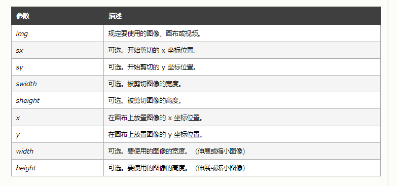

# HTML5 {ignore} 
[toc]

# 新增的属性

- ``placeholder`` input标签上的提示文本，属性值为属性名

```html
    <input type="text" placeholder="请输入" name="" id="">
```

- ``Calendar`` 

 - input标签的类型

    - ``text``

    - ``password``

    - ``radio``
    
    - ``checkbox``
    
    - ``file``

    - ``submit``

  - input标签的其他类型

    - ``date`` ``time`` ``week`` ``datetime-local`` 日期时间选择框（Chrome支持，Safari、IE不支持）

    - ``number`` 数字输入框（Chrome支持，Safari、IE不支持）

    - ``email`` 邮箱输入框（Chrome、火狐支持，Safari、IE不支持）

    - ``color`` 颜色选择器（Chrome支持，Safari、IE不支持）

    - ``range`` 滑轮数值选择器（Chrome、火狐支持，Safari、IE不支持）

    ```html
        <form action="">
        <input type="range" min="1" max="100" name="" id="">
        <input type="submit" value="提交">
    </form>
    ```
    
    - ``search`` 输入时自动提示历史输入（Chrome支持，Safari支持一部分，IE不支持）

    - ``url`` 网址输入框（Chrome、火狐支持，Safari、IE不支持）

- ``contentEditable``

    选中的文字可修改，可继承给子级，默认值false，不可修改（没有兼容性问题）

- ``draggable``

    - 可拖拽属性（Chrome、Safari兼容，火狐不兼容）

    - a标签、img标签的draggable属性默认为true
  
- ``hidden``

- ``context-menu``

- ``Data-Val``（自定义属性）

# 新增的标签

## 语义化标签

一群类似于div的标签，只是名字不同，本质上都是div

```html
    <!-- header头部 -->
    <header></header>

    <!-- footer底部 -->
    <footer></footer>

    <!-- nav导航条 -->
    <nav></nav>

    <!-- article文章，可引用 -->
    <article></article>

    <!-- section段落 -->
    <section></section>

    <!-- aside侧边栏 -->
    <aside></aside>
```

## canvas & svg

canvas：适合用于小面积的绘画，适合动画，用js去画

svg：矢量图，放大不会失真，适合大面积的贴图，通常动画较少或者较简单，用标签和css去画

### canvas
```html
    <style>
        canvas {
            width: 500px;
            height: 300px;
            border: 1px solid black;
        }
    </style>
    <!-- 行间样式设置canvas画布的大小 -->
    <canvas class="can" width="500px" height="300px"></canvas>
    <script>
        var canvas = document.querySelector('.can');
        // 获取画笔canvas.getContext('2d')
        var ctx = canvas.getContext('2d');
        ctx.moveTo(100, 100);//起笔位置
        ctx.lineWidth = 10;//画笔粗细
        ctx.lineTo(200, 100);//画到的下一个位置
        ctx.lineTo(200, 200);
        // ctx.closePath();//闭合起始点
        // ctx.fill();//填充闭合后的图形
        ctx.stroke()//渲染画的路径

        ctx.beginPath();//重新开始画一笔
        ctx.moveTo(200, 200);
        ctx.lineWidth =5
        ctx.lineTo(200, 300);
        ctx.lineTo(300, 200);
        ctx.stroke()
    </script>
```

### svg

```html
    <style>
        .line1{
            /* 线条颜色 */
            stroke: black;
            /* 线条宽度 */
            stroke-width: 10px;
        }
        .line2{
            stroke: red;
            stroke-width: 4px;
        }
    </style>
    <svg width="500px" height="300px" style="border:1px solid">
        <!-- line 画线    rect 画矩形 -->
        <!-- x1 y1 x2 y2  表示线条的起始点 -->
        <line class="line1" x1 ='100' y1='100' x2 ='200' y2= '200'></line> 
        <line class="line2" x1 ='200' y1='300' x2 ='300' y2= '200' ></line>
        <!-- rx ry 表示矩形在X轴和Y轴方向上的圆角度 -->
        <rect height="100" width="100" x= '0' y ='0' rx= '10' ry = '10'></rect>
    </svg>
```



## Audio & Video

```html

    <audio src="" controls></audio>
    <video src="" controls></video>
```

video.play() 播放

video.paused 判断视频是否暂停，默认值为false

video.duration 视频/音频的总时间，单位为s 

video.currentTime   视频/音频当前播放的时间，单位为s

video.playbackRate  播放速率

video.valume 播放音量

document.documentElement.requestFullscreen() 全屏展示浏览器，但仍需设置播放界面的大小

# 新增的API

- 定位（需要地理位置的功能）

    获取地理位置，定位（GPS）

    只能在https协议和file协议获取位置

    latitude: 纬度

    longitude: 经度
    
    ```js
    window.navigator.geolocation.getCurrentPosition(function (position) {console.log(position)});
    ```

    
- 重力感应（陀螺仪）

指南针原理
```js
        // 陀螺仪，只有带有陀螺仪的设备才支持体感

        // event 的三个属性
        // alpha：指北（指南针），[0,360)，当为0的时候指北，180时指南
        // beta：平放的时候，beta的值为0；设备立起来（竖着立起来）90度，beta为90；设备顶部朝向地面，beta为-90
        // gamma：平放的时候，gamma的值为0；设备立起来（左边朝下横着立起来）90度，gamma为-90；设备立起来（右边朝下横着立起来）90度，gamma为90；
        window.addEventListener('deviceorientation', function (event) {
            console.log(event);
            document.getElementById('main').innerHTML = 'alpha:' + event.alpha + '<br/>' + 'beta:' + event.beta + '<br/>' + 'gamma:' + event.gamma;
        })

        // 1. 手机和电脑要在同一个局域网下
        // 2. 获取电脑的IP地址
        // 3. 在手机上输入相应的IP地址和端口进行访问
```

摇一摇原理
```js
    <div id="main"></div>
    <script>
        window.addEventListener('devicemotion', function (event) {
            // 设备在x，y，z方向上的加速度
            document.getElementById('main').innerHTML = event.acceleration.x + '<br/>' + event.acceleration.y + '<br/>' + event.acceleration.z;
            if (Math.abs(event.acceleration.x) > 9||Math.abs(event.acceleration.y) > 9||Math.abs(event.acceleration.y) > 9){
                alert('在晃');
            }
        })
    </script>
```
    
- ``request-animation-frame``

``requestAnimationFrame``兼容性极差

```html
    <div id="main"></div>
    <script>
        let timer = null;
        function move() {
            let square = document.getElementById('main');
            if (square.offsetLeft > 700) {
                cancelAnimationFrame(timer)
                timer = null;
                return;
            }
            square.style.left = square.offsetLeft + 2 + 'px';
            timer = requestAnimationFrame(move)
        }
        move();
        // requestAnimationFrame是每秒60帧
        // setInterval： 1帧（小于1/60秒），2帧，3帧
        // requestAnimationFrame：准时执行每一帧

        // cancelAnimationFrame 相当于clearTimeout
        

    </script>
```
    
- ``History``（控制当前页面的历史记录）

A-->B-->C

为了网页的性能，通常选择用单页面操作

```html
    <input type="text" name="" id="search">
    <button onclick="search()">搜索</button>
    <div id="main"></div>
    <script>
        let data = [{
            name: 'HTML'
        },
        {
            name: 'CSS'
        },
        {
            name: 'js'
        },
        {
            name: 'Node'
        }
        ]
        function search(arams) {
            let value = document.getElementById('search').value;//存下input的value
            let result = data.filter(obj => {//循环遍历，查找相对应的值
                if (obj.name.indexOf(value) > -1) {
                    return obj;//将其返回
                }
            })
            rander(result);//将返回值对div进行渲染
            history.pushState({ inPval: value }, null, '#' + value);//记录下当前锚点
        }
        function rander(randerData) {//div渲染函数
            let content = '';
            for (let i = 0; i < randerData.length; i++) {
                content += '<div>' + randerData[i].name + '</div>';

            }
            document.getElementById('main').innerHTML = content;

        }

        // 绑定popstate事件
        window.addEventListener('popstate', function (e) {//url改变会触发popstate事件，相对于hashchange，先触发popstate
            document.getElementById('search').value = e.state.inPval ? e.state.inPval : '';// 将input框的value设为之前存储的锚点数据
            let value = document.getElementById('search').value;//获取input框的value，手动进行搜索
            let result = data.filter(obj => {
                if (obj.name.indexOf(value) > -1) {
                    return obj;
                }
            })
            rander(result);
        })
        rander(data)


        window.addEventListener('hashchange', function (e) {//hash改变会触发hashchange事件（锚点改变触发）
            console.log(e);
        })
```
    
- ``LocalStorage``，``SessionStorage``（储存信息）
    
    只能储存字符串，若要储存其他类型，可传入JSON格式，再用JSON.parse()转化为字符串格式

    ``localStorage``：长期存放在浏览器的，写入localStorage（无论窗口是否关闭都需要存储）

    ``sessionStorage``：临时会话需要储存的数据,窗口关闭时sessionStorage会自动清空

    ```js
        localStorage.name = 'zt';
        localStorage.age = 18;
        localStorage.setItem ('isWorking',true);//设置
        console.log(localStorage.getItem('name'));//获取
        localStorage.removeItem('name');//移除
        localStorage.arr = JSON.stringify([1,2,3,4]);
        console.log(JSON.parse(localStorage.arr));
    ```

    ```js
        sessionStorage.name = 'zt';
        sessionStorage.age = 18;
        sessionStorage.arr = JSON.stringify([1,2,3,4]);
        console.log(JSON.parse(sessionStorage.arr));
    ```

    localStorage 和 cookie 的区别

    1. localStorage在发送请求的时候不会把数据发送出去，cookie会把所有的数据带出去
    
    2. cookie储存的数据比较少，4k，localStorage可以存放较多内容，5M左右


- ``WebSocket``（聊天室，通常用于在线聊天）

- ``FilReader``（文件读取，预览）

- ``WebWorker``（文件的异步处理，提升性能，提升交互体验）

JS是单线程语言，worker 是多线程的，不是伪多线程

worker 不能控制dom，没有window对象，不能读取本地文件，可以发送ajax，可以计算

主线程
```js
        console.log('====');
        console.log('====');
        let a = 1000000;
        let worker = new Worker('./worker.js');//创建worker对象，传入另一个线程的路径
        worker.postMessage({//worker.postMessage：向另一个线程文件传入数据
            num: a
        });
        worker.onmessage = function (e) {//监听另一个线程是否完成，完成会返回一个massage对象
            console.log(e.data);//massage对象中的数据保存在data属性中
            
        }
        // worker.terminate();//停止worker
        console.log('====');
        console.log('====');
```

次线程
```js
this.onmessage = function (e) {
    // console.log(e);//返回一个Massage对象
    let result = 0;
    for (let i = 0; i < e.data.num; i++) {
        result += i;
    }
    this.postMessage(result);//this.postMessage：将数据返回给主线程
    // this.close();//停止worker
}
```